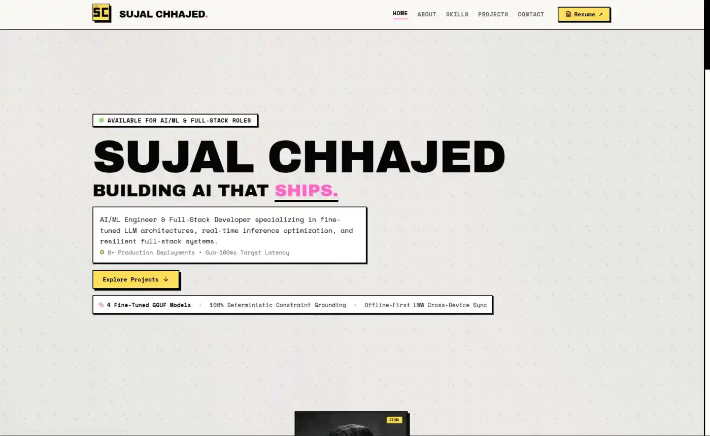

<h1 align="center">
  <br>
  ⚡ SUJAL CHHAJED
  <br>
  <sub>NEO-BRUTALIST AI/ML & FULL-STACK PORTFOLIO</sub>
</h1>

<p align="center">
  
</p>

<p align="center">
  <b>BUILDING AI THAT SHIPS — FROM FINE-TUNED LLMS TO RESILIENT PRODUCTION SYSTEMS</b>
</p>

<p align="center">
  <code>TACTILE NEO-BRUTALISM</code> · <code>HIGH CONTRAST</code> · <code>ZERO JANK</code> · <code>PRODUCTION SCALE</code>
</p>

<p align="center">
  <a href="https://sujal-chhajed.vercel.app/">
    
  </a>
  &nbsp;
  <a href="LICENSE.txt">
    
  </a>
</p>

<br>

> **BRUTALISM PHILOSOPHY:**  
> ✓ Hard 2-4px black borders · ✓ Tactile neo-brutalist offset shadows (`4px 4px 0px #000`) · ✓ Vibrant high-contrast pastel accents · ✓ Instant 0ms CSS dot matrix · ✗ No gimmick loaders · ✗ No visual lag

---

<br>

## `01` ABOUT

```
┌─────────────────────────────────────────────────────────────────────────────┐
│  SUJAL SANJAY CHHAJED                                                       │
│  ─────────────────────────────────────────────────────────────────────────  │
│  AI/ML ENGINEER & FULL-STACK DEVELOPER @ VIT CHENNAI                        │
│  SPECIALIZATION: FINE-TUNED LLMS, REAL-TIME INFERENCE, RESILIENT FULL-STACK │
│                                                                             │
│  I build end-to-end production systems that survive real-world constraints. │
└─────────────────────────────────────────────────────────────────────────────┘
```

| | |
|:--|:--|
| **📍 LOCATION** | Chennai, India |
| **🎓 EDUCATION** | Computer Science & Engineering (AI/ML) @ VIT Chennai |
| **🎯 FOCUS** | Fine-Tuned GGUF Models, DLRM Recommenders, Real-Time Streaming, Offline-First Sync |
| **🏎️ INTERESTS** | Competitive Programming, F1 (Ferrari), Cricket Analytics, Anime |

---

<br>

## `02` ARCHITECTURAL UPGRADES (OVERHAUL FROM MASTER)

The portfolio underwent a comprehensive production overhaul moving from the initial master branch to the current release:

### 1. Eliminating Gimmicks & Friction
- **Removed Loading Screen**: Stripped away the artificial pre-loader and dead spinner code. The application now renders immediately.
- **Removed Unused AI Chat & Command Palette**: Purged `ChatAssistant.tsx`, `geminiService.ts`, and `CommandPalette.tsx` to streamline the bundle and eliminate unnecessary external API latency.
- **Clean Micro-Entrance Animation**: Replaced heavy entrance barriers with a smooth, lightweight hardware-accelerated fade that loads instantly.

### 2. High-Impact Recruiter & Visitor Features
- **In-Portfolio Resume Modal**: Added `ResumeModal.tsx` featuring an embedded Google Drive PDF viewer and a high-visibility one-click direct download button.
- **Projects Role Filter Tabs**: Added dynamic role filtering (`All`, `AI/ML`, `Full-Stack`, `Data Eng`) with real-time count badges and smooth filtering in `ProjectsSection.tsx`.
- **Direct-Inspection Project Cards**: Refactored `ProjectCard.tsx` archive cards to display full descriptions, primary metric banners, and technology stack badges directly on the card surface without requiring hover popovers.
- **Recruiter Speedrun Mode**: Embedded interactive architecture pipelines and verified production metrics directly inspectable inline on each flagship project card.

### 3. Visual & Rendering Performance Overhaul
- **Instant 0ms CSS Dot Grid**: Implemented a native radial dot pattern on `body` in `index.css` that paints at 0ms, eliminating Flash of Unstyled Content (FOUC) on hard refreshes (`Ctrl+Shift+R`).
- **Synchronous Google Fonts**: Replaced asynchronous `media="print"` loading with critical stylesheet loading (`display=block`) to prevent layout shift and fallback font flashing.
- **Responsive Tablet & iPad Mini Layout**: Redesigned flagship project grid breakpoints from `md:grid-cols-3` to `lg:grid-cols-3`. Tablet devices (768px–1023px, such as iPad Mini) now display spacious, fully readable cards with responsive typography scaling (`break-words min-w-0`).
- **Interactive Ambient Canvas & WebGL**: Preserved interactive 2D canvas mouse-proximity dot dilation (`BackgroundGrid.tsx`) and subtle ambient pastel GPU aura (`HeroShader.tsx`).

### 4. Production SEO & Discoverability
- **Search Engine Optimization**: Full `<title>`, description, keywords, and OpenGraph/Twitter Cards with absolute asset URLs.
- **Structured Data**: schema.org JSON-LD `Person` markup.
- **Google Search Console**: Verified domain ownership via `<meta name="google-site-verification">`, plus auto-generated `robots.txt` and `sitemap.xml`.

---

<br>

## `03` FLAGSHIP SYSTEMS

| PROJECT | ROLE / DOMAIN | ARCHITECTURE HIGHLIGHTS | PRIMARY METRIC |
|:--------|:--------------|:------------------------|:---------------|
| **[Phonos.ai](https://phonosai.vercel.app/)** | AI/ML & Recommender | 2-stage DLRM combining 5D specification embeddings, YouTube aspect sentiment gating, and calibrated XGBoost ranking. | 100% Constraint Validity |
| **[MetaGen](https://metagen-one.vercel.app)** | GenAI / LLM Systems | 4 custom fine-tuned Q4_K_M GGUF models on Groq LPUs with ~800 tokens/sec streaming and 5-tier failover cascade down to local llama.cpp. | ~800 tokens/sec Streaming |
| **[Loopa](https://loopa1.netlify.app/)** | Full-Stack & Systems | Dual-client (Kotlin Jetpack Compose Android + Vanilla JS PWA) with Supabase Realtime, Offline-First Last-Write-Wins (LWW) sync, and Gemini 2.5 semantic search. | 100% Offline Availability |

---

<br>

## `04` TECH STACK

| CATEGORY | TECHNOLOGIES |
|:---------|:-------------|
| **Frontend Core** | React 18, TypeScript, Vite 7 |
| **Styling & Theme** | Tailwind CSS (Custom Neo-Brutalist Palette & Tactile Shadows) |
| **Animation & Canvas** | Framer Motion, HTML5 Canvas 2D, WebGL Shaders |
| **Icons & UI** | Lucide React |
| **Deployment & Hosting** | Vercel (Production Edge) |

---

<br>

## `05` RUN LOCALLY

**Prerequisites:** Node.js 18+ and npm.

```bash
# Clone the repository
git clone https://github.com/Dragonballsuper-1995/sujal_chhajed_portfolio.git

# Navigate into the project directory
cd sujal_chhajed_portfolio

# Install dependencies
npm install

# Start development server
npm run dev
```

```
┌──────────────────────────────────────────┐
│  🚀  LOCAL SERVER: http://localhost:5173  │
└──────────────────────────────────────────┘
```

| SCRIPT | DESCRIPTION |
|:-------|:------------|
| `npm run dev` | Starts Vite development server with Hot Module Replacement |
| `npm run build` | Runs TypeScript type checking (`tsc`) and generates optimized production bundle in `dist/` |
| `npm run preview` | Previews the production build locally |

---

<br>

## `06` CONTACT & CONNECT

<p align="center">
  <a href="mailto:sujalchhajed925@gmail.com">
    
  </a>
</p>

<p align="center">
  <a href="https://github.com/Dragonballsuper-1995"></a>
  &nbsp;
  <a href="https://www.linkedin.com/in/sujalchhajed925/"></a>
  &nbsp;
  <a href="https://x.com/sujal_chhajed"></a>
  &nbsp;
  <a href="https://sujal-chhajed.vercel.app/"></a>
</p>

---

<p align="center">
  <b>CRAFTED WITH PRECISION, HARD BORDERS, AND RELENTLESS ENGINEERING.</b>
</p>
